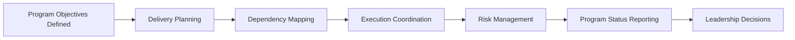
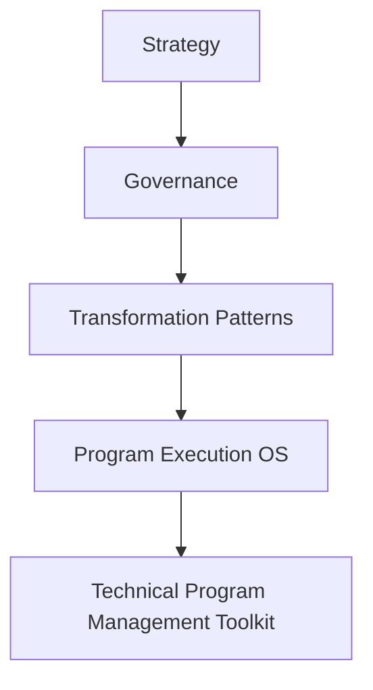

# Technical Program Management Toolkit

> **Author:** Somer Walker  
> Creator of the Transformation Operating Framework, a model for aligning strategy, governance, and program execution in complex organizations.

This repository provides a practical collection of tools, templates, and frameworks used by Technical Program Managers to coordinate complex technology initiatives.

Technical Program Managers (TPMs) operate at the intersection of engineering, leadership, and execution. Their role is to help organizations translate strategic initiatives into coordinated delivery across multiple teams.

This repository contains the practical artifacts used to manage dependencies, communicate program health, mitigate risks, and maintain alignment across stakeholders.

---

## Part of the Transformation Operating Framework

This repository is a supporting component of the **Transformation Operating Framework**, a layered model for aligning strategy, governance, transformation initiatives, and execution across complex organizations.

The master framework repository provides the conceptual architecture connecting the various supporting modules.

Transformation Operating Framework  
https://github.com/somerwalker/transformation-operating-framework

---

## Why Technical Program Management matters

Large technology initiatives rarely fail because of engineering capability alone. They fail when coordination across teams breaks down, dependencies are unmanaged, and leadership loses visibility into execution.

Technical Program Management provides the operational structure required to coordinate complex delivery environments.

Technical Program Managers help organizations:

- coordinate delivery across multiple engineering teams
- manage dependencies between systems and services
- track risks and mitigation strategies
- maintain executive visibility into program health
- facilitate cross-team communication and planning
- ensure initiatives remain aligned with strategic goals

Without structured program coordination, complex initiatives can quickly lose alignment and momentum.

---

## Repository Model

This repository organizes Technical Program Management artifacts around common execution responsibilities.

The toolkit focuses on five core areas of program coordination:

- Dependency Coordination  
- Risk and Issue Management  
- Milestone Tracking  
- Stakeholder Communication  
- Program Health Monitoring  

These areas represent the practical structures TPMs use to maintain execution visibility and coordination across multiple teams.

Example coordination workflow:

This model helps organizations maintain clarity across large initiatives and ensures leadership remains informed about program health and risk.

---

## Repository Contents

### 📘 Documentation

| File | Description |
|-----|-------------|
| docs/dependency-management.md | Methods for tracking cross-team dependencies |
| docs/program-health.md | Framework for monitoring program progress and status |
| docs/cross-team-planning.md | Guidance for coordinating planning across multiple teams |
| docs/risk-management.md | Approaches for identifying and mitigating program risks |
| docs/executive-communication.md | Best practices for communicating program updates to leadership |

---

### 🧰 Templates

| File | Description |
|-----|-------------|
| templates/program-status-template.md | Template for weekly program status updates |
| templates/dependency-tracker-template.md | Template for documenting cross-team dependencies |
| templates/risk-register-template.md | Template for tracking program risks |
| templates/milestone-tracking-template.md | Template for monitoring program milestones |
| templates/stakeholder-communication-template.md | Template for mapping stakeholder communication |

---

### 📊 Examples

| File | Description |
|-----|-------------|
| examples/example-program-status.md | Example weekly program status report |
| examples/example-risk-register.md | Example risk register for a cross-team initiative |
| examples/example-dependency-map.md | Example dependency tracking artifact |

---

## How This Repository Helps Organizations

Organizations executing large technology initiatives often struggle to maintain coordination across multiple teams and systems.

This toolkit helps organizations:

- improve cross-team coordination
- maintain visibility into delivery progress
- identify and mitigate risks earlier
- communicate program health clearly to leadership
- maintain alignment across complex initiatives

By providing structured artifacts and repeatable coordination practices, this repository helps organizations execute large initiatives with greater predictability and transparency.

---

## Relationship to the Transformation Operating Framework

This repository provides the execution artifacts used within the **Delivery layer** of the Transformation Operating Framework.

While the framework defines how strategy, governance, and transformation initiatives align, this toolkit provides the practical structures Technical Program Managers use to coordinate delivery across teams.

See the architecture overview:  
https://github.com/somerwalker/transformation-operating-system

## Intellectual Property

The frameworks and methodologies documented in this repository are original work created by Somer Walker as part of the **Transformation Operating Framework**.

This repository provides conceptual documentation, examples, and templates for educational and professional reference.

Commercial use of the methodology or derivative consulting frameworks requires written permission from the author.

---

## Author

Somer Walker  
Enterprise Program Leader | Operational Excellence | AI Transformation

LinkedIn  
https://www.linkedin.com/in/somerwalker

---

## Contributing

Suggestions, improvements, and additional examples are welcome.  
Please review `CONTRIBUTING.md` before submitting a pull request.

---

## Copyright

Copyright © 2026 Somer Walker
