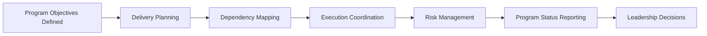

# Technical Program Management Toolkit

Part of the **Transformation Operating System** framework.

See the architecture overview:  
https://github.com/somerwalker/transformation-operating-system

A practical collection of tools, templates, and frameworks used by Technical Program Managers to coordinate complex technology initiatives.

Technical Program Managers (TPMs) operate at the intersection of engineering, leadership, and execution. Their role is to help organizations translate strategic initiatives into coordinated delivery across multiple teams.

This repository provides practical artifacts used to manage dependencies, communicate program health, mitigate risks, and maintain alignment across stakeholders.

---

# What Technical Program Managers Do

TPMs help organizations execute large initiatives by bringing structure and visibility to complex work.

Typical TPM responsibilities include:

- coordinating delivery across multiple engineering teams  
- managing dependencies between systems and services  
- tracking risks and mitigation strategies  
- maintaining executive visibility into program health  
- facilitating cross-team communication and planning  
- ensuring initiatives remain aligned with organizational goals  

Because complex initiatives often involve many teams and stakeholders, TPMs rely on structured artifacts and processes to maintain clarity and momentum.

---

# Core Execution Areas

Technical Program Management typically focuses on five core execution areas:

### Dependency Coordination
Tracking cross-team dependencies and ensuring workstreams remain aligned.

### Risk and Issue Management
Identifying blockers early and coordinating mitigation across teams.

### Milestone Tracking
Monitoring progress against major delivery checkpoints.

### Stakeholder Communication
Providing structured updates to engineering leadership and executives.

### Program Health Monitoring
Maintaining visibility into program progress, risks, and overall status.

---

# Example Program Coordination Workflow

---

# Repository Contents

This repository provides practical documentation, reusable templates, and example artifacts used by Technical Program Managers.

---

## Documentation

| File | Description |
|-----|-------------|
| `docs/dependency-management.md` | Methods for tracking cross-team dependencies |
| `docs/program-health.md` | Framework for monitoring program progress and overall status |
| `docs/cross-team-planning.md` | Guidance for coordinating planning across multiple teams |
| `docs/risk-management.md` | Approaches for identifying and mitigating program risks |
| `docs/executive-communication.md` | Best practices for communicating program updates to leadership |

---

## Templates

| File | Description |
|-----|-------------|
| `templates/program-status-template.md` | Structured template for weekly program status updates |
| `templates/dependency-tracker-template.md` | Template for documenting and monitoring cross-team dependencies |
| `templates/risk-register-template.md` | Template for tracking program risks and mitigation plans |
| `templates/milestone-tracking-template.md` | Template for monitoring major program milestones |
| `templates/stakeholder-communication-template.md` | Template for mapping communication with stakeholders |

---

## Examples

| File | Description |
|-----|-------------|
| `examples/example-program-status.md` | Example weekly program status report |
| `examples/example-risk-register.md` | Example risk register for a cross-team initiative |
| `examples/example-dependency-map.md` | Example dependency tracking artifact |

---

# How This Toolkit Helps Organizations

Organizations executing large technology initiatives often face challenges coordinating work across teams. Without structured tools and communication frameworks, programs can quickly lose alignment.

This toolkit helps teams:

- improve cross-team coordination  
- maintain visibility into delivery progress  
- surface risks earlier in the delivery lifecycle  
- communicate program health clearly to leadership  
- maintain alignment across complex initiatives  

These practices help organizations deliver large programs with greater predictability and transparency.

---

# Future Improvements

Future updates may include:

- additional templates for dependency management  
- sample program dashboards  
- expanded examples of TPM artifacts  
- integration with program governance frameworks  
- guidance for scaling TPM practices in large organizations  

Contributions and suggestions are welcome.

---

# Contributing

Contributions are welcome. If you have ideas for improving the frameworks, templates, or examples in this repository, please review the contribution guidelines in `CONTRIBUTING.md` and open an issue or pull request.

---

# Author

**Somer Walker**  
Enterprise Program Leader | AI Transformation | Operational Excellence

Background leading large-scale infrastructure, cloud, and AI initiatives across global organizations. Focused on turning strategy into disciplined execution.

LinkedIn  
https://www.linkedin.com/in/somerwalker