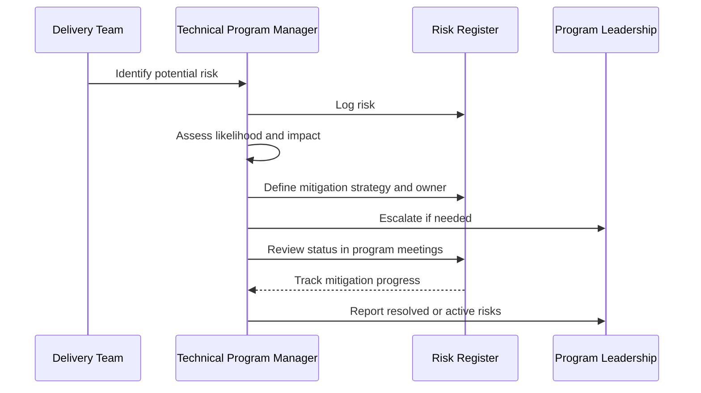

# Risk Management

This document outlines practical methods for identifying, documenting, and mitigating risks within large technical programs.

Every large technical program involves uncertainty. Risk management helps teams identify and address potential issues before they disrupt delivery.

## Common Risk Categories

Typical program risks include:

- technical complexity  
- integration challenges  
- resource constraints  
- shifting priorities  
- dependency delays  

## Risk Register

Programs typically maintain a risk register that tracks:

- risk description  
- likelihood  
- potential impact  
- mitigation strategy  
- owner responsible for mitigation  

---

---

## Risk Review Cadence

Risks should be reviewed regularly during program coordination meetings to ensure mitigation plans remain effective.

Early visibility into risks improves program outcomes.

---
---

Part of the **Transformation Operating Framework**

Transformation Operating Framework  
https://github.com/somerwalker/transformation-operating-framework

Copyright © 2026 Somer Walker

This material is provided for educational and professional reference.  
Commercial use or derivative consulting frameworks requires permission from the author.
