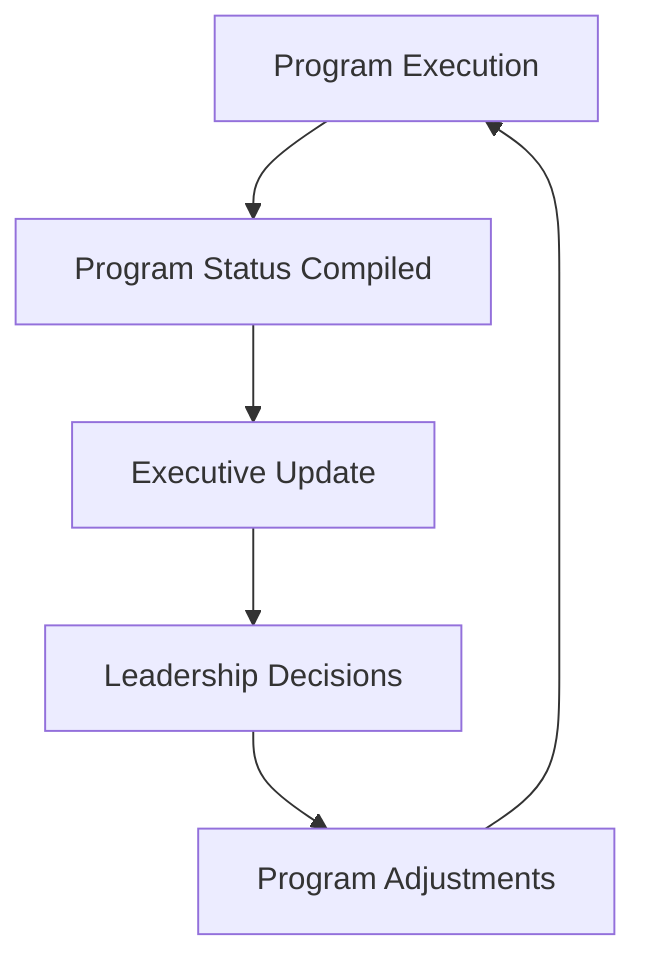

# Executive Communication

This document describes best practices for communicating program progress, risks, and decisions to executive leadership.

Large technical programs require clear communication with leadership to maintain alignment and support timely decision-making.

## Key Elements of Executive Updates

Executive updates should provide a concise overview of program progress, key risks, and any leadership decisions required.

Effective updates typically include:

- overall program status  
- key achievements  
- major risks or issues  
- decisions required  
- upcoming milestones

| Element | Purpose | Typical Content |
|---|---|---|
| Program Status | Provide an at-a-glance view of delivery health | Overall status indicator (Green / Yellow / Red) with a brief summary of current program health |
| Key Achievements | Highlight meaningful progress since the previous update | Completed milestones, major deliverables, and significant accomplishments since the previous report |
| Risks and Issues | Surface items that could impact delivery timelines or scope | Description of the risk or issue, **owner responsible**, mitigation action required to return to Green, and the **target resolution date** |
| Decisions Required | Identify areas where leadership input is needed | Funding approvals, scope decisions, priority changes, or other leadership guidance required |
| Upcoming Milestones | Provide visibility into near-term delivery expectations | Key milestones, releases, or major checkpoints expected in the next reporting period |

Every risk or issue reported to executive leadership should include a clearly identified owner, the mitigation action required to restore program health, and the expected resolution date.

## Executive Communication Flow

Executive communication connects program execution with leadership decision-making.  
Clear status reporting allows leadership to understand progress, address risks, and provide direction when needed.

## Communication Principles

Strong executive communication should be:

- concise  
- transparent  
- consistent  
- focused on decision support  

Executive leadership should quickly understand program health and where their involvement is needed.

---
---

Part of the **Transformation Operating Framework**

Transformation Operating Framework  
https://github.com/somerwalker/transformation-operating-framework

Copyright © 2026 Somer Walker

This material is provided for educational and professional reference.  
Commercial use or derivative consulting frameworks requires permission from the author.
