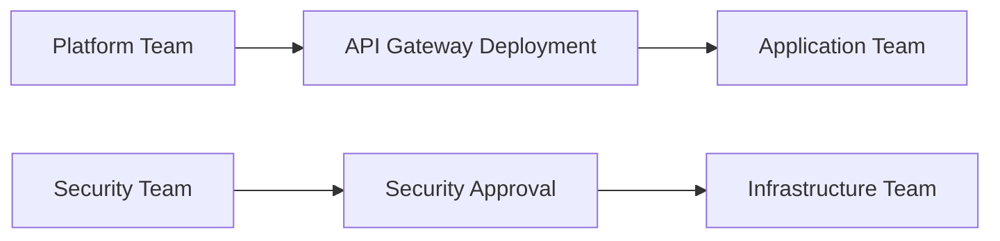

# Example Dependency Map

This example illustrates how cross-team dependencies might be documented within a large technical program.

| Dependency | Team Responsible | Dependent Team | Status |
|------------|-----------------|---------------|-------|
| API Gateway deployment | Platform Team | Application Team | In Progress |
| Security approval | Security Team | Infrastructure Team | Pending |

---
## Dependency Relationships

The diagram below illustrates how dependencies connect workstreams across teams within a program.

---
---

Part of the **Transformation Operating Framework**

Transformation Operating Framework  
https://github.com/somerwalker/transformation-operating-framework

Copyright © 2026 Somer Walker

This material is provided for educational and professional reference.  
Commercial use or derivative consulting frameworks requires permission from the author.
