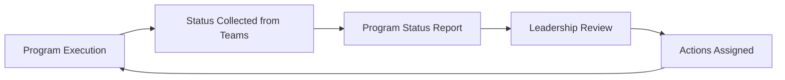

# Example Program Status

This example illustrates how a weekly program status update might be structured for executive leadership visibility in a large technical program.

Program Name: Global Platform Deployment  
Reporting Period: Week 3  

## Status

When program status is not Green, the update should include a brief explanation and a clear path to returning the program to Green. 

Each issue should identify:

- action required to return to Green
- owner responsible for the action
- target completion date

### Example:

Overall Status: **Yellow**

Dependency delays may affect the next milestone if not resolved within two weeks.  

| Issue | Action to Return to Green | Owner | Target Resolution |
|------|---------------------------|------|------------------|
| API gateway deployment delay | Confirm updated delivery schedule with Platform Team | Platform Director | April 15 |

## Achievements

- regional infrastructure deployed  
- security review completed  

## Risks

| Risk | Likelihood | Impact | Mitigation Action | Owner | Target Resolution |
|-----|------------|--------|------------------|-------|------------------|
| Vendor delivery delay | Medium | High | Establish contingency plan and confirm alternate vendor availability | Vendor Management Lead | April 12 |

## Next Milestones

| Milestone | Teams Involved | Target Date | Status Notes |
|-----------|---------------|-------------|--------------|
| Service integration testing | Platform Team, Application Team | April 18 | Dependency on API gateway deployment |
| Launch readiness review | Platform Team, Security Team, Operations | April 25 | Pending security certification completion |

## Program Status Reporting Flow

### Leadership Alignment

Program updates should reflect commitments that have been reviewed with the responsible team leads or directors.

If an owner, mitigation action, or milestone commitment is missing, the gap should be clearly visible in the report so that the program leadership team can resolve the ownership during the status review meeting.

---
---

Part of the **Transformation Operating Framework**

Transformation Operating Framework  
https://github.com/somerwalker/transformation-operating-framework

Copyright © 2026 Somer Walker

This material is provided for educational and professional reference.  
Commercial use or derivative consulting frameworks requires permission from the author.
