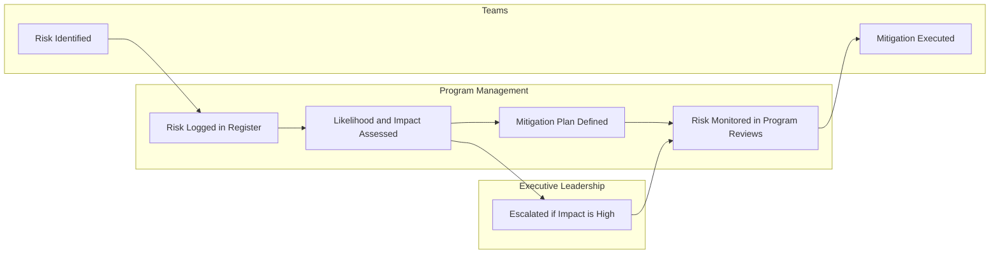

# Example Risk Register

This example demonstrates how risks might be documented and tracked in a large technical program.

## Risk Register

Every risk should include a clearly identified owner, the mitigation action required to reduce or eliminate the risk, and the expected resolution date. Missing ownership or mitigation details should be visible so that the program leadership team can resolve the gap during risk review meetings.

### Example:

| Risk ID | Risk Description | Likelihood | Impact | Mitigation Action | Owner | Target Resolution |
|--------|-----------------|------------|--------|------------------|------|------------------|
| R1 | Vendor hardware delivery delay | Medium | High | Conduct weekly vendor checkpoint and confirm alternate supplier availability | Infrastructure Lead | April 12 |
| R2 | Engineering team resource constraints | High | Medium | Reprioritize workstreams and adjust sprint commitments | Program Lead | April 10 |

## Risk Management Lifecycle

Risks in complex technical programs move through a structured lifecycle that ensures potential issues are identified early, assessed for impact, and actively managed until they are resolved. Typically, risks are first identified by delivery teams during execution, documented by program management in the risk register, and then assessed for likelihood and impact. Mitigation actions are defined with clear ownership and expected resolution dates, and risks are reviewed regularly during program coordination meetings. When risks exceed the program’s tolerance or threaten major milestones, they may be escalated to executive leadership for additional decision support.

The lifecycle diagram below illustrates one example of how risk management responsibilities may flow between engineering teams, program management, and executive leadership. Each organization may structure this process differently, so teams should work with their program leaders and executives to define a risk management lifecycle that aligns with their governance structure and decision-making processes.

### Example:

---
---

Part of the **Transformation Operating Framework**

Transformation Operating Framework  
https://github.com/somerwalker/transformation-operating-framework

Copyright © 2026 Somer Walker

This material is provided for educational and professional reference.  
Commercial use or derivative consulting frameworks requires permission from the author.
